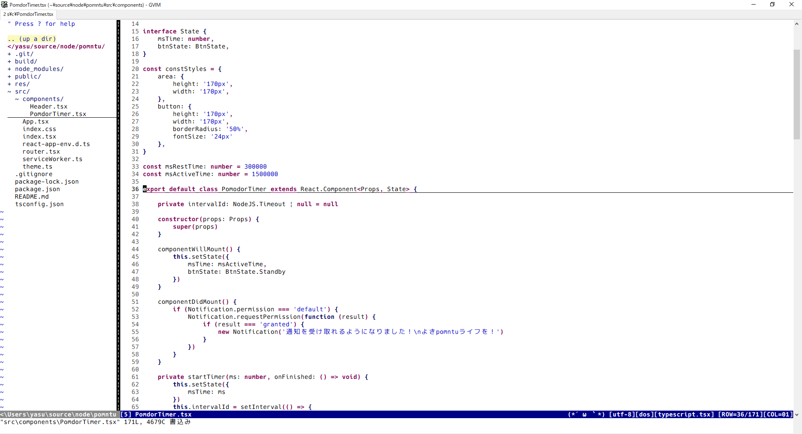
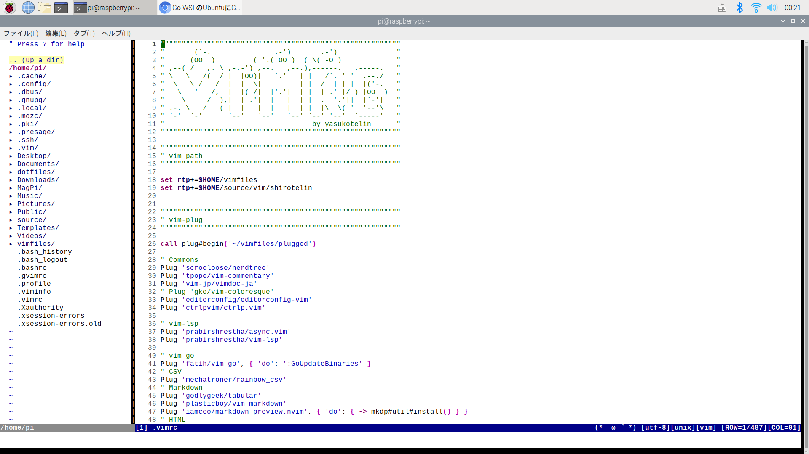
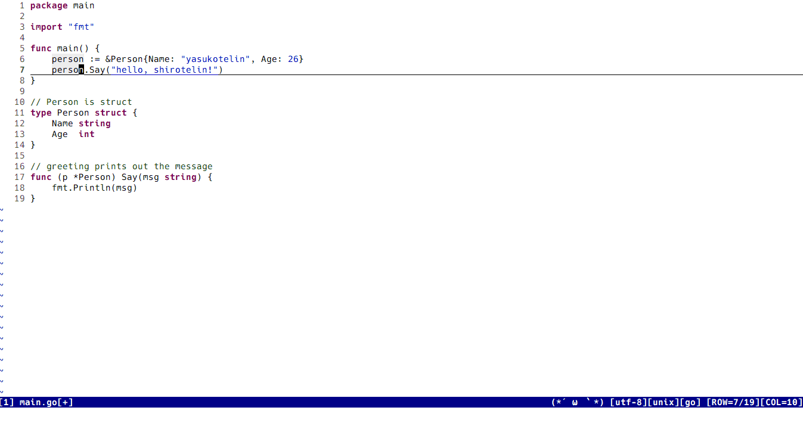

<h1 align="center">🎉 shirotelin 🎉</h1>

<p align="center">shirotelin is New Classical light colorscheme for Vim, GVim and neovim!</p>

Ultimate standard light color scheme "shirotelin" is inspired by Eclipse, notepad++, InteliJ, Visual Studio, Hidemaru editor, sakura editor, and more⚡

Version2 Released! More classical color and easier to see😍

Supports Windows, macOS and Linux!

<table>
    <tr>
        <th>GVim (Windows)</th>
    </tr>
    <tr>
        <td></td>
    </tr>
    <tr>
        <th>Vim (on macOS)</th>
    </tr>
    <tr>
        <th></th>
    </tr>
    <tr>
        <th>Vim (on Linux - Raspbian)</th>
    </tr>
    <tr>
        <th></th>
    </tr>
</table>

## Install

If you use any vim plugin manager, refer to the following.

**vim-plug**

```vim
Plug 'yasukotelin/shirotelin'
```

**dein.vim**

```vim
call dein#add('yasukotelin/shirotelin')
```

**Manual Install**

If you want to manual install, you download `colors/shirotelin.vim` and puts on your `~/.vim/colors` directory.

## Settings

Write to your `.vimrc`.

```vimrc
colorscheme shirotelin
set background=light
```

### Underline


Write this to your `.vimrc`

**Underline ON**

```.vimrc
set cursorline
```

**Underline OFF**

```.vimrc
set nocursorline
```

## Screenshots

**Cursor Number**

If you set `set cursorline`, you can see the highlighted number cursor.


---

**TODO**


---

**Search**


---

**Complete**



---

**diff**


---

**vim-lsp diagnostics highlight**

comming soon..

---

**coc.nvim diagnostics hightlight**

Supported for diagnostics in [coc.nvim](https://github.com/neoclide/coc.nvim).<br>
Error and Warning are highlighted. Info and Hint are not highlighted and only shown Singed.


---

**Go**


---

**HTML**


---

**NERDTree**


---

**vim-plug**


