<h1 align="center">🎉 shirotelin 🎉</h1>

<p align="center">shirotelin is Ultimate standard New Classical light colorscheme for Vim, GVim and neovim!</p>

Ultimate standard light color scheme "shirotelin" is inspired by Eclipse, notepad++, InteliJ, Visual Studio, Hidemaru editor, sakura editor, and more⚡

Version2 Released! More classical color and easier to see😍

Supports Windows, macOS and Linux!

Supported CUI / GUI🔥

<table>
    <tr>
        <th>GVim (Windows)</th>
    </tr>
    <tr>
        <td>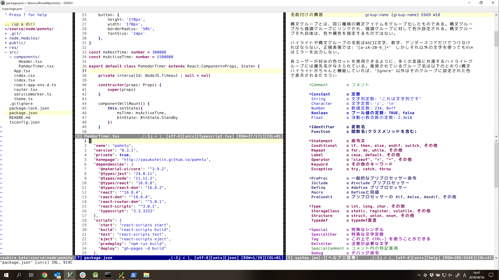</td>
    </tr>
    <tr>
        <th>Vim (on macOS)</th>
    </tr>
    <tr>
        <th>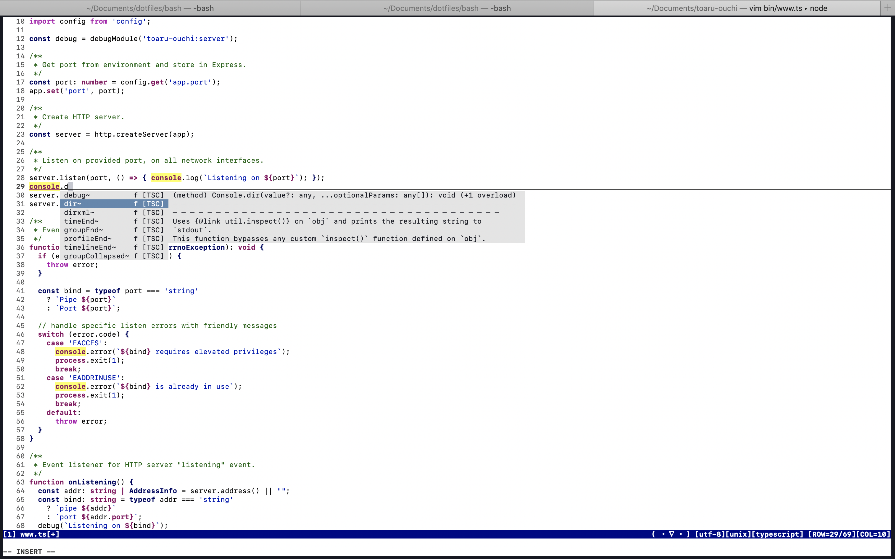</th>
    </tr>
    <tr>
        <th>Vim (on Linux - Raspbian)</th>
    </tr>
    <tr>
        <th>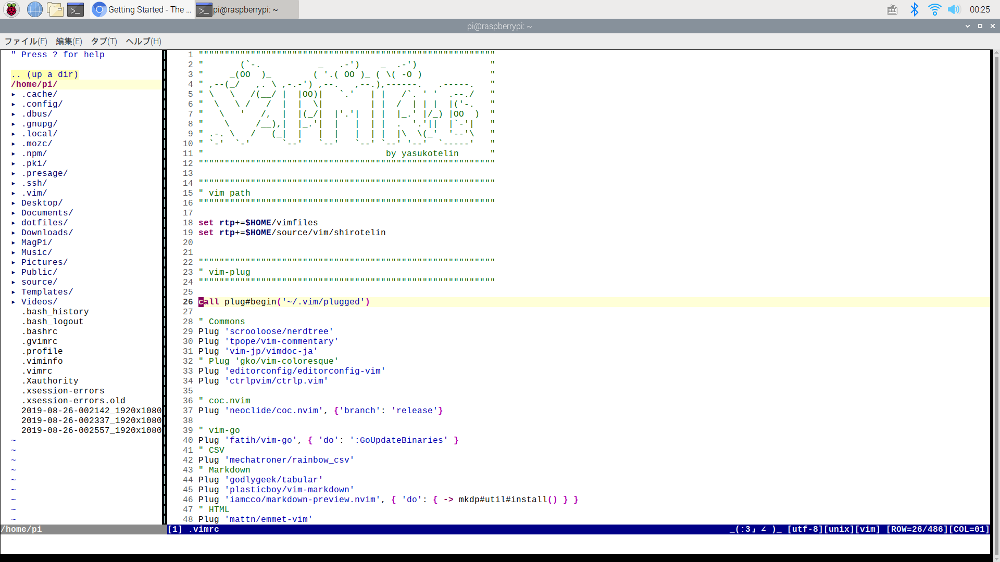</th>
    </tr>
</table>

## Supported Plugins⛏

- [✔] NERDTree https://github.com/scrooloose/nerdtree
- [✔] Markdown https://github.com/plasticboy/vim-markdown
- [✔] coc.nvim https://github.com/neoclide/coc.nvim
- [✔] dart-vim-plugin https://github.com/dart-lang/dart-vim-plugin

## Install

If you use any vim plugin manager, refer to the following.

**vim-plug**

```vim
Plug 'yasukotelin/shirotelin'
```

**dein.vim**

```vim
call dein#add('yasukotelin/shirotelin')
```

**Manual Install**

If you want to manual install, you download `colors/shirotelin.vim` and puts on your `~/.vim/colors` directory.

## Settings

Write to your `.vimrc`.

```vimrc
colorscheme shirotelin
set background=light
```

## Features

### Cursorline

If you write `set cursorline` on the .vimrc, you can see the highlighted cursor line.<br>
When you don't need cursor line,  wirte `set nocursorline`.

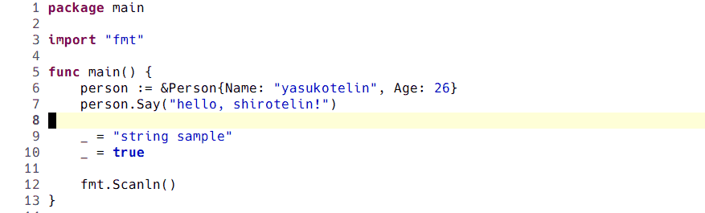

### TODO

TODO is highlighted with background Green.


### Search

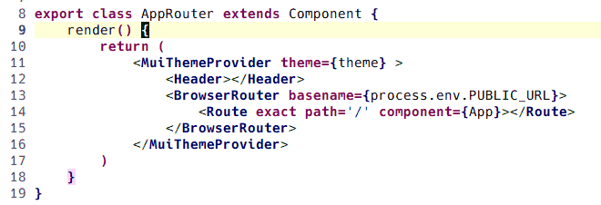

### Complete

Complete and popup are simple and classical color 😍

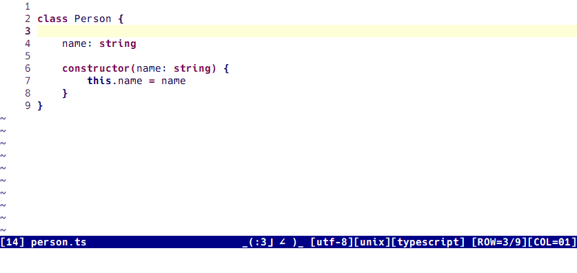

### Diff

Supported diff color 🤷‍♂️

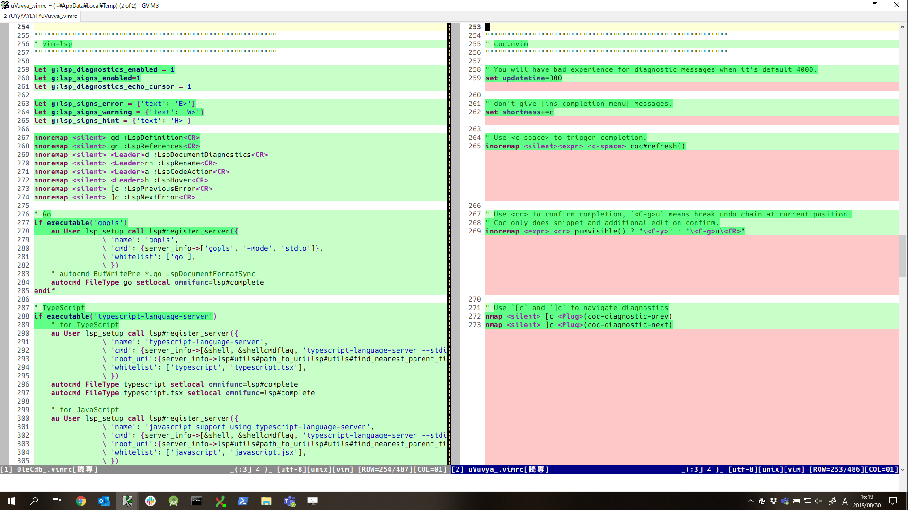

## Features for Plugins

I add colors for plugins actively.

## coc.nvim

Supported for [coc.nvim](https://github.com/neoclide/coc.nvim).<br>

- [✔] Error colors
- [✔] Warning colors
- [✔] Info colros
- [✔] Hint colors
- [✔] Highlight Text
- [✔] CocFloating

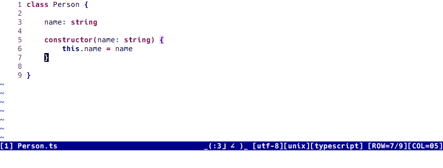

## Markdown

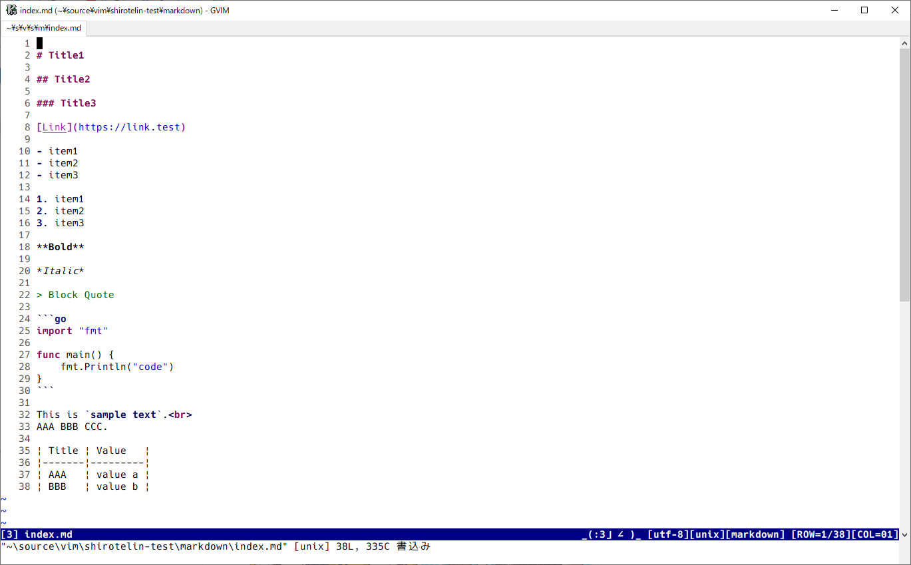

## NERDTree

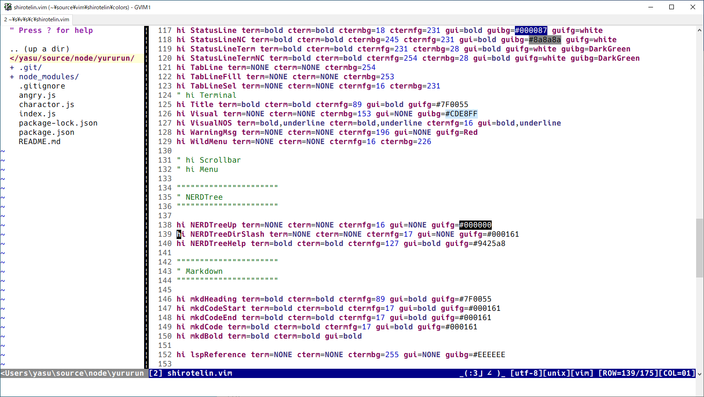

## dart-vim-plugin

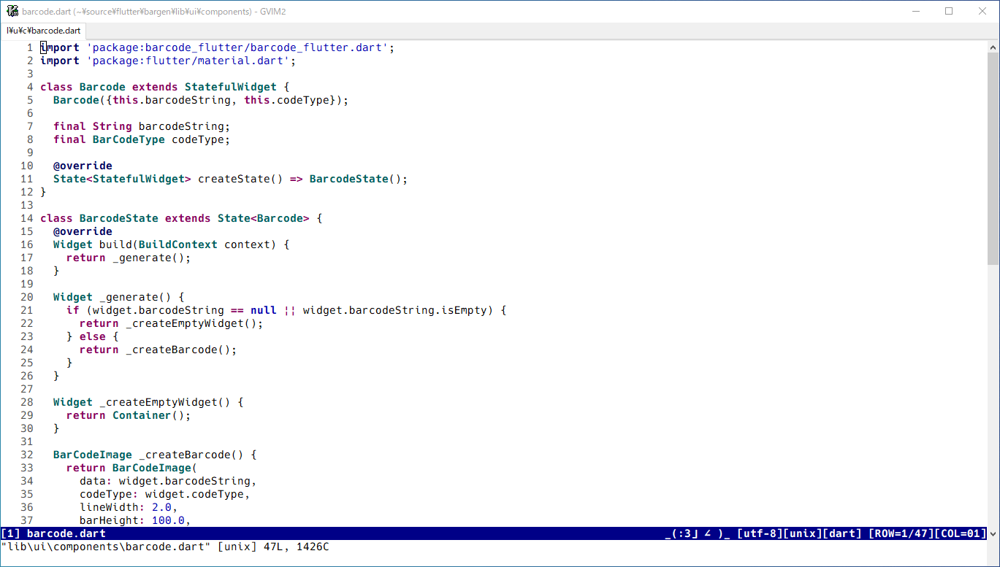
