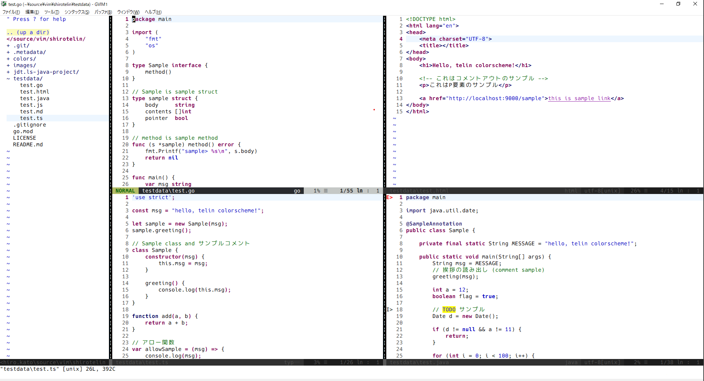

<p align="center" style="font-size: 80px">🎉 shirotelin 🎉</p>
<p align="center">shirotelin is New Classical light colorscheme for Vim!</p>

---

Ultimate standard light color scheme is inspired by Eclipse, notepad++, InteliJ, Visual Studio, Hidemaru editor, sakura editor, and more⚡

> **NOTE** this scheme is creating now! comming soon.



## Features

- Eclipse base and classical color.
- So easy to see because good contrast.
- Tested with many test.* files.

## Install

If you use any vim plugin manager, refer to the following.

**vim-plug**

```vim
Plug 'yasukotelin/shirotelin'
```

**dein.vim**

```vim
call dein#add('yasukotelin/shirotelin')
```

If you want to manual install, you download `colors/shirotelin.vim` and puts on your `colors` directory.

## Screenshots

**NERDTree**


**vim-plug**


