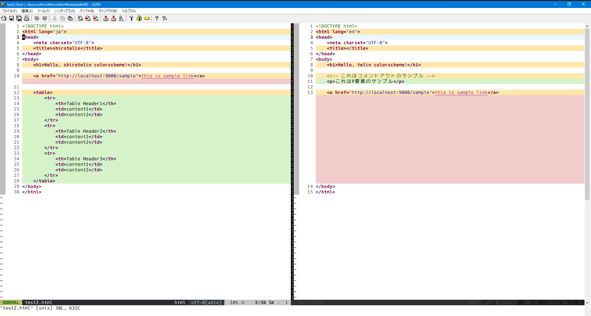

<h1 align="center">🎉 shirotelin 🎉</h1>

<p align="center">shirotelin is New Classical light colorscheme for Vim and GVim!</p>

Ultimate standard light color scheme is inspired by Eclipse, notepad++, InteliJ, Visual Studio, Hidemaru editor, sakura editor, and more⚡


## Install

If you use any vim plugin manager, refer to the following.

**vim-plug**

```vim
Plug 'yasukotelin/shirotelin'
```

**dein.vim**

```vim
call dein#add('yasukotelin/shirotelin')
```

If you want to manual install, you download `colors/shirotelin.vim` and puts on your `~/.vim/colors` directory.

Write to your `.vimrc`.

```vimrc
colorscheme shirotelin
set background=light
```

## Screenshots

**Search**


---

**Completion**


---

**diff**



---

**Go**


---

**HTML**


---

**NERDTree**


---

**vim-plug**


